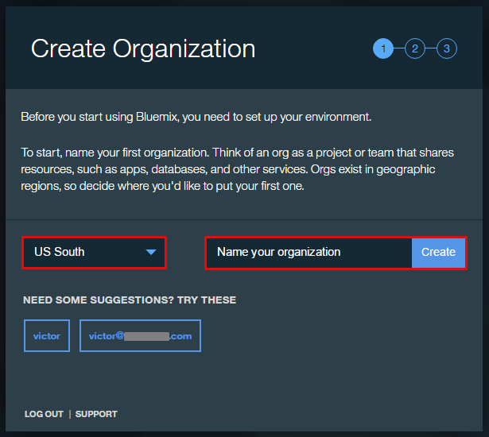
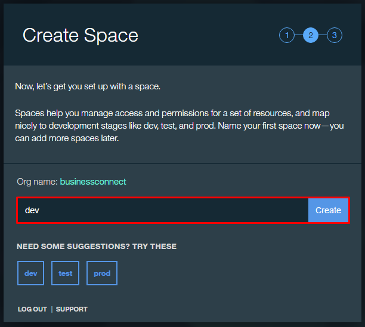

#Hands on Lab - Data Scientist.

As a Data Scientist, you have to turn raw data into meaning using state-of-the-art techniques leveraging open source and enterprise applications. Perform this hands-on lab leveraging Apache Spark, Jupyter, Python, and R to derive sales performance for a specific product line, then build an advanced Machine Learning model in R.

##Welcome to IBM Data Science Experience (DSX) - datascience.ibm.com

IBM Data Science Experience (DSX) is the premier offering that seamlessly allows data scientists and data engineers to connect data from multiple domains, to analyze it, and visually to explore the data for insights. The solutions that were not possible previously or required months of development effort can now be done in DSX in a very fast and intuitive manner.

Python and R have become the de-facto standards in the domain of data science: they support multiple machine learning algorithms and ability to visualize the outcomes of the research.

DSX brings together the data science development experience accumulated in R, Python, Scala, and Java, intuitive data connectivity and processing capabilities of Spark, and the state-of-art dynamic visualization technology using Brunel, Pixiedust, and RStudio Shiny.

#Step 1. Get on IBM Data Science Experience (DSX).
##Create a Bluemix Account.
A Bluemix ID is needed to log into DSX. If you already have a Bluemix account, skip this part.

1.  Go to [www.bluemix.net](https://www.bluemix.net)

2.  If you have followed the first lab about the Business Analyst, you should land on the following page where you can choose to signup

 > 

	Else, just click the signup button on the top right on the standard Bluemix homepage

 > 

3.  On the next page fill in the corresponding fields and click “Create Account”. If you already registered to Watson Analytics before, your IBMid should be recognized and the registration form should be shortened.

 > 

4.  You will see a page asking you to check your email for next steps. Check your email that you used to sign up for Bluemix

 > 

5.  Click on the “confirm your account” link

 > 

6.	You can then login to Bluemix from [www.bluemix.net](https://www.bluemix.net)

7.	If you don't automatically get to it, follow this link to go to the first configuration steps: https://console.ng.bluemix.net/login?state=/home/onboard/

8.	You will be asked to create an organization. At this moment, you can chose between multiple Bluemix public regions. Choose the "US South" region in Dallas to access all the new services (required to configure Data Science Experience)

 > 

9.	And then, to create a space

 > 

10. When it's done, you can go ahead by clicking "I'm ready"

 > 

##Log into Data Science Experience (DSX).

1. Go to [http://datascience.ibm.com/](http://datascience.ibm.com/)

2. Click the Log In button on the DSX landing page to sign in with your Bluemix credentials. Type in your Bluemix email address and password, then click Sign In.

 > 

 > You are now in the Data Science Experience. Depending on the plan you chose, your environment is automatically set up with at least one Apache Spark instance and at least 5 GB of object storage. From here you can create a new project, notebook, or connection. You can also explore any of the tutorials, videos, sample notebooks or articles in the community.

 > 

#Step 2. Perform Hands on Exercises.

##[Part 1. Root Cause Analysis (Interactive Analytics) Start Here](./interactive-analytics/)
This lab exercise uses an IPython Notebook in DSX to connect with dashDB, explores sales, product data and analyze sales performance for a specific product line. Pixiedust, a Python based visualization package is used to visualize the results.

##[Part 2. Create Resolution (Machine Learning) Start Here](./machinelearning/)
In this lab, we will explore how a data scientist utilizes DSX and IBM Bluemix cloud services to easily analyze data using machine learning techniques and to visualize the outcomes using DSX, R, and Brunel. For the lab, we have chosen two algorithms to demonstrate supervised and unsupervised machine learning in DSX. Decision tree-based classification is one of the domains that allowed scientists to have direct insights into the reasoning behind classification choices. Association rules algorithms support market basket analysis.

