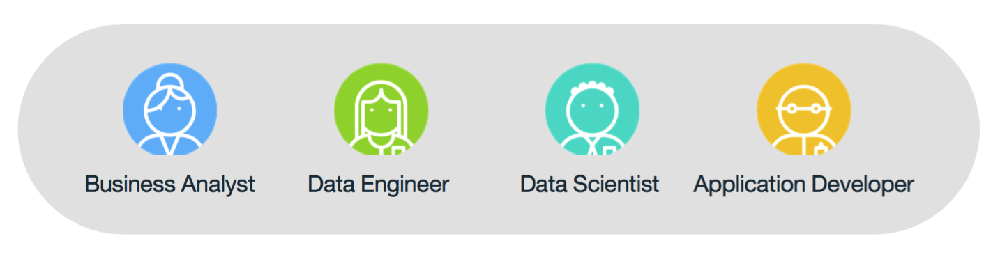
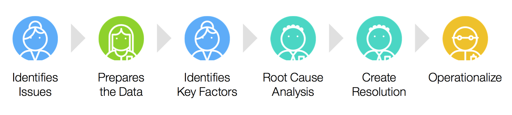

#IBM Watson DataWorks - Hands-on Labs
##Experience the IBM Watson DataWorks Project
###Where teams can collaboratively work together...

###Accelerating End to End Analytics from months to minutes...
In this series of hands-on lab, you follow the story of an outdoor equipment retailer focused on improving its margin.
You'll use different data storage technologies such as Bluemix Object Store (OpenStack Swift), DashDB (RDBMS), Cloudant (NoSQL CouchDB compatible database).
For demonstration purpose and to keep full independance between the labs, different datasets are successively loaded in different data storages.
The objective of this series is to let you manipulate several cloud interfaces and components that can be used by your data team to provide data loading, transformation, exploration, analytics, reporting and so on.
You can successively take the role of a Business Analyst, a Data Engineer, a Data Scientist and an Application Developer.
##[Business Analyst Lab - Click Here](./1.businessanalyst/)
As a Business Analyst, you need to analyze, discover and visualize business data to derive insights.
Perform this hands-on lab using guided exploration capabilities on customer transaction data to uncover insights about transactions and product affinities. You can then define your business questions and strategy more accurately to communicate with your hierarchy and other data professionnals from your company.
##[Data Engineer Lab - Click Here](./2.dataengineer/)
As a Data Engineer, you need to cleanse, organize, standardize, tranform and move data at scale between many data repositories on cloud and on premise.
Perform this hands-on lab and in a few clicks you can standardize, transform, and move sales and customer data into a relational data warehouse.
##[Data Scientist Lab - Click Here](./3.datascientist/)
As a Data Scientist, you have to turn raw data into meaning using state-of-the-art techniques leveraging open source and enterprise applications. Perform this hands-on lab leveraging Apache Spark, Jupyter, Python, and R to derive sales performance for a specific product line, then build an advanced Machine Learning model in R.
##[Application Developer Lab - Click Here](./4.applicationdeveloper/)
As an Application Developer, you need multiple application and data services that facilitate a modern architecture and delivery practices around mobile, microservices, DevOps and continuous delivery. Perform this hands-on lab to quickly build and deploy a live dashboard with Node.js connected to a document data service.

